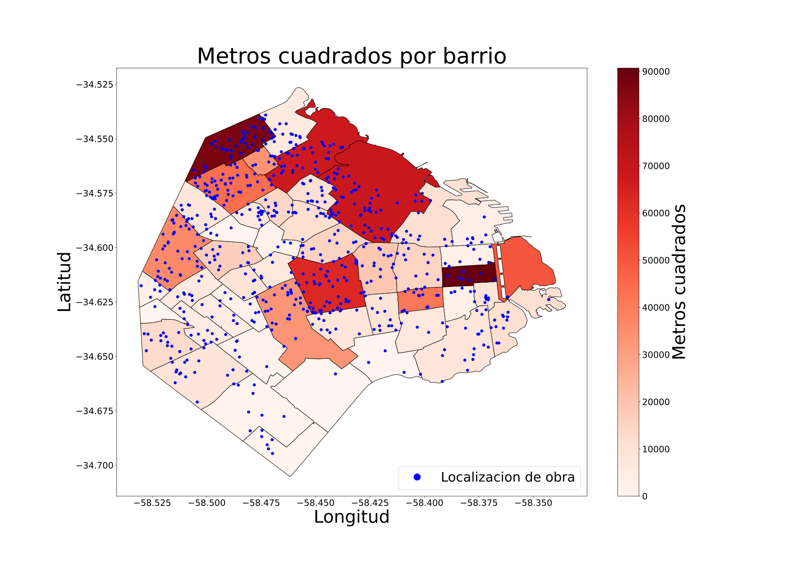

# Grafico obra publica CABA 2019

Obras registradas en la ciudad de Buenos Aires en jun-sep del 2019. Un simple grafico realizado con geopandas

- Dataset de obra publica obtenido de [aqui](https://data.buenosaires.gob.ar/dataset/obras-registradas). A este sele ha aplicado una limpieza con limpiar.py

- Dataset de geolocalizacion de barrios obtenido de [aqui](https://data.buenosaires.gob.ar/dataset/barrios)
